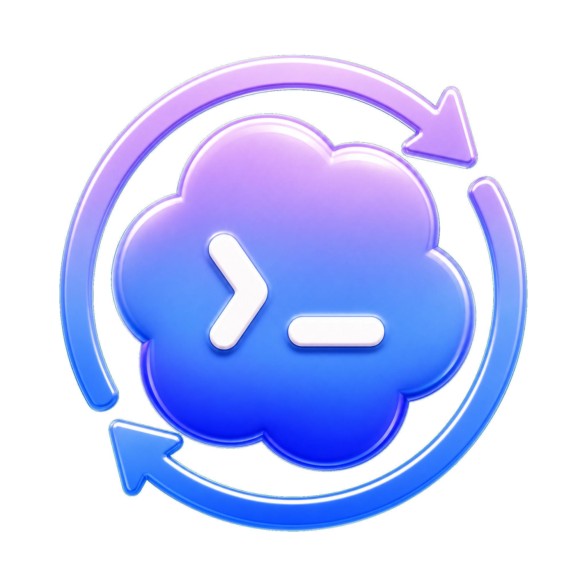

<p align="center">
  
</p>

<p align="center">
  
</p>

<h1 align="center">Codex App Manager</h1>

<p align="center">
  跨平台桌面客户端 —— 一键安装、增量更新、干净卸载官方 Codex 桌面应用,自带国内可达的自更新。<br>
  A cross-platform desktop client to install, incrementally update, and cleanly uninstall the official Codex desktop app — with built-in, China-reachable self-update.
</p>

<p align="center">
  <a href="https://codexapp.agentsmirror.com"></a>
  <a href="https://github.com/Wangnov/Codex-App-Manager/releases/latest"></a>
  <a href="https://github.com/Wangnov/Codex-App-Manager/stargazers"></a>
  <a href="https://github.com/Wangnov/Codex-App-Manager/releases/latest"></a>
  <a href="https://github.com/Wangnov/Codex-App-Manager/releases/latest"></a>
  <a href="https://github.com/Wangnov/Codex-App-Manager/actions/workflows/ci.yml"></a>
  <a href="https://github.com/Wangnov/Codex-App-Manager/releases/latest"></a>
  <a href="https://github.com/Wangnov/Codex-App-Manager/releases/latest"></a>
  <a href="https://github.com/Wangnov/Codex-App-Manager/releases/latest"></a>
  <a href="https://v2.tauri.app/"></a>
  <a href="./LICENSE"></a>
</p>

<p align="center">
  <a href="https://codexapp.agentsmirror.com"><b>官网 · Official Website</b></a> · <a href="#readme-cn">中文</a> · <a href="#readme-en">English</a>
</p>

---

<!-- ⬇ 赞助商 SPONSOR(最顶部,中英双语共享) -->
<div align="center">
<table>
  <tr>
    <td align="center" width="170">
      <a href="https://duckcoding.ai"></a>
    </td>
    <td width="560">
      <b>本项目由 <a href="https://duckcoding.ai">DuckCoding</a> 赞助支持</b><br>
      面向国内开发者的 Claude Code / Codex / Gemini CLI API 中转,国内直连、按量计费。<br>
      <b>Sponsored by <a href="https://duckcoding.ai">DuckCoding</a></b> — a pay-as-you-go API relay for Claude Code / Codex / Gemini CLI.
    </td>
  </tr>
</table>
</div>

---

<a id="readme-cn"></a>

# 中文

`Codex App Manager` 是官方 OpenAI Codex 桌面应用的**安装 / 更新 / 卸载管理器**:在本机检测已安装的 Codex,规划并执行安装、增量更新与干净卸载,并提供一键启动。它消费上游 [codex-app-mirror](https://github.com/Wangnov/codex-app-mirror) 的镜像与 Sparkle 更新源来管理 Codex 本体(payload),同时**自身**也通过一套国内可达的镜像完成自更新。Manager 不构建、不修改 Codex,只做"安装与更新"这层客户端体验。

## 能力一览

| 能力 | 说明 |
|---|---|
| 🧭 **一站式管理** | 检测本机 Codex 安装状态,规划安装 / 更新 / 卸载,一键启动 Codex |
| 🔄 **增量更新(macOS)** | 消费 codex-app-mirror 的 Sparkle appcast,只下载版本间的 **delta 差量**,EdDSA 签名字节级校验,失败自动回滚 |
| 🪟 **Windows** | MSIX / 便携版安装与暂存更新,安装后做 MSIX 健康检查并对被裁剪的系统给出提示 |
| 🆕 **应用自更新** | Manager 自身经 **R2(全球)+ IHEP S3(国内)** 镜像更新,GitHub 兜底;更新签名签的是字节,镜像逐字节复制后依旧有效 |
| 🌏 **国内可达** | 自更新与 payload 下载共用同一条镜像短链,按地域自动选路(国内 IHEP / 海外 R2),对用户透明 |
| 🎨 **温润材质 UI** | OKLCH 配色、材质质感、明暗双主题精雕,GSAP 编排的入场与转场动效 |
| 🌐 **11 种语言** | 跟随系统语言自动选择,含阿拉伯语 RTL |
| 🍎 **已签名公证** | macOS 走 Developer ID 签名 + Apple 公证;Windows updater 产物以更新私钥签名 |

## 下载与安装

### macOS —— Homebrew(推荐)

```bash
brew install --cask wangnov/tap/codex-app-manager
```

### 直接下载

到 [最新 GitHub Release](https://github.com/Wangnov/Codex-App-Manager/releases/latest) 下载(全球),或用 **agentsmirror 镜像直链**(国内免梯子,Cloudflare Worker 按地域选路:中国大陆走 IHEP、海外走 R2):

| 平台 | 文件 | 镜像直链 |
|---|---|---|
| Apple Silicon Mac | `CodexAppManager_aarch64.dmg` | [⤓ 镜像下载](https://codexapp.agentsmirror.com/manager/latest/CodexAppManager_aarch64.dmg) |
| Intel Mac | `CodexAppManager_x86_64.dmg` | [⤓ 镜像下载](https://codexapp.agentsmirror.com/manager/latest/CodexAppManager_x86_64.dmg) |
| Windows x64 | `CodexAppManager_x64-setup.exe` | [⤓ 镜像下载](https://codexapp.agentsmirror.com/manager/latest/CodexAppManager_x64-setup.exe) |

macOS 版本经 **Developer ID 签名 + Apple 公证**,首次打开不会被 Gatekeeper 拦截。镜像直链恒指向**最新版**——`/manager/latest/` 由 Cloudflare Worker 自动解析到当前发布,无需随版本更新;装好后 Manager 还会通过**应用内自更新**保持最新(见下)。

> 安装 Manager 后,真正的 Codex 桌面应用由 Manager 负责安装与更新——你不需要单独去下载 Codex 本体。

## 应用自更新(Manager 自身)

Manager 内置 Tauri updater,按以下顺序检查自身新版本:

1. `https://codexapp.agentsmirror.com/manager/latest.json` —— 自有镜像,**全球走 R2、中国大陆自动分流到 IHEP S3**
2. `https://github.com/Wangnov/Codex-App-Manager/releases/latest/download/latest.json` —— GitHub 兜底

`latest.json` 里的签名签的是**安装包字节**而非 URL,镜像只是逐字节复制并改写下载地址,所以签名始终有效。每次正式发版,CI 会自动把产物与改写后的 `latest.json` 同步到两套镜像(安装包置于 `…/manager/<版本>/…` 的版本化路径,长缓存安全;`latest.json` 在固定根路径短缓存),因此**无需依赖 GitHub 也能自更新**——这对国内网络尤其重要。

## 管理与更新 Codex 本体

Manager 通过上游镜像管理 Codex 桌面应用本体:

- **macOS**:读取镜像的 Sparkle appcast(arm64 / x64),对照本机已装版本规划更新,优先下载 delta 差量包,校验 Sparkle 签名后**原地替换**,失败回滚;无匹配 delta 时回退完整包。
- **Windows**:从镜像获取 MSIX / 便携版并暂存更新,支持自定义安装目录,安装后做健康检查。

## 工作原理

### 检测 → 规划 → 执行

应用先在本机探测 Codex 的安装状态与平台能力,生成安装 / 更新 / 卸载计划,确认后再执行破坏性操作(更新前做版本与签名校验,规避 TOCTOU)。

### 双后端镜像 + 按地域分流

自更新与 payload 下载共用 `codexapp.agentsmirror.com` 这条短链,由 Cloudflare Worker 路由:全球从 R2 直供,中国大陆按 `CF-IPCountry` 分流到 IHEP S3 的预签名地址——同一条链接,自动选最优节点。

### 发布流水线

打 `v*` tag 触发 `release.yml`:三平台构建(瞬时下载失败自动重试)→ macOS inside-out Developer ID 签名 + 公证 + 重打 updater 包 → Windows updater 产物签名 → 发布 GitHub Release → 自动同步到 R2 + IHEP 镜像。

### 生态:codex-app-mirror

Manager 是 [codex-app-mirror](https://github.com/Wangnov/codex-app-mirror) 的下游客户端。镜像负责把官方 Codex 安装包原样、可校验、国内可达地分发,并提供 Sparkle 增量更新源;Manager 负责把这些能力变成本地的安装与更新体验。两者职责清晰、各自窄而稳。

## 技术栈与本地开发

- **前端**:React 19 · TypeScript · Vite · GSAP
- **外壳**:Tauri v2(无边框弹层窗口)
- **后端**:Rust 命令层 + 应用服务 / 端口 / 平台适配;`codex-mac-engine`(Sparkle)与 `codex-win-engine`(MSIX/便携)两个独立 crate

```bash
npm install
npm run tauri:dev      # 本地开发
npm run check          # 类型检查
npm run tauri:build    # 本地构建(未签名)
```

## 边界

- 不修改、不重打包 Codex 安装包
- 不绕过 OpenAI / Microsoft 的授权或本机安装策略
- 不伪造或重算 Sparkle 签名(只字节级复制官方签名)
- 不替代 OpenAI、Microsoft Store 的官方分发渠道

## 致谢

- **[LINUX DO](https://linux.do/)** 社区 —— 安装体验、更新链路、问题反馈的讨论都汇聚于此。
- **中国科学院高能物理研究所(IHEP)** —— 提供国内 S3 镜像存储,让中国大陆的自更新与下载低延迟直达。

## Star History

<p align="center">
  <a href="https://star-history.com/#Wangnov/Codex-App-Manager&Date">
    <picture>
      <source media="(prefers-color-scheme: dark)" srcset="https://api.star-history.com/svg?repos=Wangnov/Codex-App-Manager&type=Date&theme=dark" />
      
    </picture>
  </a>
</p>

## 许可

[MIT](./LICENSE)。本项目与 OpenAI、Microsoft 无隶属或背书关系。

---

<a id="readme-en"></a>

# English

`Codex App Manager` is an **install / update / uninstall manager** for the official OpenAI Codex desktop app: it detects the locally installed Codex, plans and performs install, incremental update, and clean uninstall, and offers one-click launch. It consumes the upstream [codex-app-mirror](https://github.com/Wangnov/codex-app-mirror) (mirror + Sparkle update feed) to manage the Codex payload, and **also self-updates** through its own China-reachable mirror. The Manager does not build or modify Codex — it owns only the client-side "install & update" experience.

## At a glance

| Capability | Detail |
|---|---|
| 🧭 **One-stop management** | Detects the local Codex install, plans install / update / uninstall, launches Codex in one click |
| 🔄 **Incremental update (macOS)** | Consumes codex-app-mirror's Sparkle appcast, downloads only the **delta** between versions, verifies EdDSA signatures byte-for-byte, rolls back on failure |
| 🪟 **Windows** | MSIX / portable install and staged updates; MSIX health check after install, with a warning on stripped systems |
| 🆕 **Self-update** | The Manager updates itself via **R2 (global) + IHEP S3 (China)**, with GitHub fallback; signatures sign the bytes, so a byte-identical mirror stays valid |
| 🌏 **Reachable in China** | Self-update and payload downloads share one mirror link, auto-routed by region (IHEP in China, R2 elsewhere) — transparent to users |
| 🎨 **Warm material UI** | OKLCH palette, material depth, polished dark + light themes, GSAP-orchestrated entrances and transitions |
| 🌐 **11 languages** | Auto-selected from the system locale, including Arabic RTL |
| 🍎 **Signed & notarized** | macOS Developer ID signing + Apple notarization; the Windows updater artifact is signed with the updater key |

## Download & install

### macOS — Homebrew (recommended)

```bash
brew install --cask wangnov/tap/codex-app-manager
```

### Direct download

Grab your platform's file from the [latest GitHub Release](https://github.com/Wangnov/Codex-App-Manager/releases/latest) (global), or use the **agentsmirror mirror** (no VPN needed in China; a Cloudflare Worker routes by region — IHEP for mainland China, R2 elsewhere):

| Platform | File | Mirror link |
|---|---|---|
| Apple Silicon Mac | `CodexAppManager_aarch64.dmg` | [⤓ mirror](https://codexapp.agentsmirror.com/manager/latest/CodexAppManager_aarch64.dmg) |
| Intel Mac | `CodexAppManager_x86_64.dmg` | [⤓ mirror](https://codexapp.agentsmirror.com/manager/latest/CodexAppManager_x86_64.dmg) |
| Windows x64 | `CodexAppManager_x64-setup.exe` | [⤓ mirror](https://codexapp.agentsmirror.com/manager/latest/CodexAppManager_x64-setup.exe) |

The macOS builds are **Developer ID signed + Apple notarized**, so Gatekeeper won't block first launch. The mirror links always resolve to the **latest** release — `/manager/latest/` is auto-resolved to the current version by the Cloudflare Worker, with no per-release edits; after install, the Manager also keeps **itself** up to date via in-app self-update (below).

> Once the Manager is installed, it installs and updates the actual Codex desktop app for you — you don't need to download Codex separately.

## Self-update (the Manager itself)

The Manager ships the Tauri updater and checks for new versions of itself in this order:

1. `https://codexapp.agentsmirror.com/manager/latest.json` — its own mirror: **R2 globally, auto-failover to IHEP S3 for mainland China**
2. `https://github.com/Wangnov/Codex-App-Manager/releases/latest/download/latest.json` — GitHub fallback

The signatures in `latest.json` sign the **installer bytes**, not the URL, so the mirror only re-hosts the bytes verbatim and rewrites the download URL — the signature stays valid. On every stable release, CI syncs the artifacts and a rewritten `latest.json` to both mirrors (installers under a versioned path `…/manager/<version>/…` so long caching is safe; `latest.json` at the fixed root with a short cache), so **self-update never depends on GitHub** — which matters most inside China.

## Managing & updating Codex itself

The Manager manages the Codex desktop payload through the upstream mirror:

- **macOS**: reads the mirror's Sparkle appcast (arm64 / x64), plans against the installed build, prefers the delta enclosure, verifies the Sparkle signature, then **swaps in place** with rollback on failure; falls back to the full archive when no delta matches.
- **Windows**: fetches the MSIX / portable build from the mirror and stages the update, with a configurable install directory and a post-install health check.

## How it works

### Detect → plan → execute

The app first probes the local Codex install state and platform capabilities, produces an install / update / uninstall plan, and only then performs destructive operations (with a version + signature check before the swap to guard against TOCTOU).

### Two-tier mirror + geo routing

Self-update and payload downloads share the `codexapp.agentsmirror.com` link, fronted by a Cloudflare Worker: global traffic is served straight from R2, mainland-China traffic is routed by `CF-IPCountry` to a presigned IHEP S3 URL — one link, auto-routed to the fastest node.

### Release pipeline

Pushing a `v*` tag triggers `release.yml`: three-platform build (with automatic retry on transient download hiccups) → macOS inside-out Developer ID signing + notarization + updater repackage → Windows updater artifact signing → publish the GitHub Release → auto-sync to the R2 + IHEP mirror.

### Ecosystem: codex-app-mirror

The Manager is the downstream client of [codex-app-mirror](https://github.com/Wangnov/codex-app-mirror). The mirror distributes the official Codex installers verbatim, verifiably, and reachably inside China, and serves the Sparkle incremental-update feed; the Manager turns those into a local install-and-update experience. Both stay narrow and stable, with clear responsibilities.

## Tech stack & local development

- **Frontend**: React 19 · TypeScript · Vite · GSAP
- **Shell**: Tauri v2 (frameless popover window)
- **Backend**: Rust command layer with app services / ports / platform adapters; two standalone crates `codex-mac-engine` (Sparkle) and `codex-win-engine` (MSIX/portable)

```bash
npm install
npm run tauri:dev      # local development
npm run check          # type-check
npm run tauri:build    # local (unsigned) build
```

## Non-goals

- Does not modify or repackage Codex installers
- Does not bypass OpenAI / Microsoft authorization or local install policies
- Does not forge or recompute Sparkle signatures (official signatures are copied verbatim)
- Is not a replacement for official OpenAI / Microsoft Store distribution

## Acknowledgements

- **[LINUX DO](https://linux.do/)** community — the home for feedback on install experience, update links, and bug reports.
- **Institute of High Energy Physics, Chinese Academy of Sciences (IHEP)** — provides the S3 mirror storage that keeps self-update and downloads fast and reachable inside mainland China.

## Star History

<p align="center">
  <a href="https://star-history.com/#Wangnov/Codex-App-Manager&Date">
    <picture>
      <source media="(prefers-color-scheme: dark)" srcset="https://api.star-history.com/svg?repos=Wangnov/Codex-App-Manager&type=Date&theme=dark" />
      
    </picture>
  </a>
</p>

## License

[MIT](./LICENSE). Not affiliated with or endorsed by OpenAI or Microsoft.
