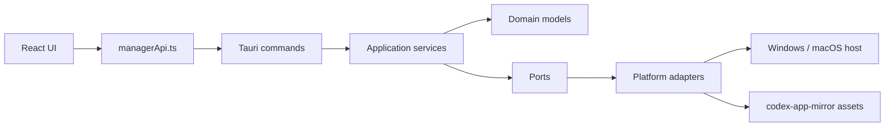

# Architecture

`Codex App Manager` separates the manager app from the Codex payload.

## Layers

### UI

Renders status, endpoint metadata, health checks, and operation plans. It does not know how to install, update, or remove Codex.

### Command Bridge

`src-tauri/src/commands.rs` exposes a small stable command surface to the UI.

### Application Services

Application services decide what should happen for a requested operation. They produce plans and later will coordinate downloads, verification, staging, replacement, and rollback.

### Domain

Domain models are serializable and platform-neutral. They describe targets, settings, mirror endpoints, installation state, health reports, and operation plans.

### Ports

Ports describe capabilities the application needs without binding to Windows or macOS details.

### Adapters

Adapters implement platform choices:

- Windows MSIX/App Installer preferred path
- Windows fixed-path unpacked fallback
- macOS DMG mount, verify, replace, rollback path

## Planned Install Flow

1. Read current target and managed install state.
2. Fetch `latest/manifest` and `SHA256SUMS.txt`.
3. Select the platform payload.
4. Download to a staging directory.
5. Verify checksum and package metadata.
6. Install or replace using the selected platform adapter.
7. Persist manager provenance state.

## Planned Update Flow

1. Compare installed provenance with latest mirror metadata.
2. Download the new payload only when the source fingerprint changes.
3. Stage the payload and verify it before touching the install root.
4. Stop or ask the user to close Codex.
5. Replace atomically where possible.
6. Keep rollback material until launch health succeeds.

## Planned Uninstall Flow

1. Confirm the install root is managed by this app.
2. Remove managed files and registrations.
3. Preserve user data by default.
4. Support an explicit purge mode for local Codex data.

